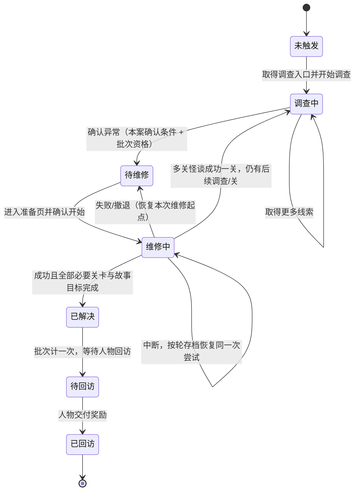

# 统一事件管理架构 v1.0

> 2026-09。本页是事件、任务与怪谈的统一总图：事件与案件／尝试的分层、案件状态机与转移条件、时间／进度／盘面／资源的保存范围、成功／失败／撤退／中断的结果，以及地图投放、批次资格、奖励领取与档案重放。它把已确认的 D-020～D-024、D-029、D-032、D-034～D-035、D-068～D-075、D-085～D-087 收拢成一份能闭合检查的架构，替代[统一事件管理设计草案](../07-设计参考/统一事件管理设计草案.md)的"后续统一设计"预留。分册见[事件完整配置结构](26-事件完整配置结构.md)、[单关结算与时间推进流程](18-单关结算与时间推进流程.md)、[存档与恢复流程](21-存档与恢复流程.md)、[任务系统](11-任务系统.md)。

## 这一页解决什么

内容库里同时存在"会反复出现的普通订单""一次性的剧情推进""长期追踪的任务""持续到解决的怪谈"和"每次重新开始的维修盘面"。它们寿命不同、失败后去向不同、奖励领取位置不同。本页回答四个问题：

1. 一次内容单元到底是哪个对象，它在内存／存档里怎样分层。
2. 一个怪谈从发现到回访会经过哪些状态、由什么条件推动。
3. 每次尝试结束后，什么东西留在世界、什么东西作废、时间如何推进。
4. 地图投放、批次资格与奖励领取各自独立，不互相锁死。

## 一、对象分层

| 对象 | 含义 | 记录位置 | 寿命 |
|---|---|---|---|
| 事件模板 | 一次内容定义：触发、内容、时间、结果、奖励 | 事件库、任务库、怪谈文件夹 | 长期，可生成多个实例 |
| 事件实例 | 当前地图上实际出现的一次可处理内容 | 运行时状态 + 事件页 | 处理结算后结束；普通实例昼夜交替替换 |
| 任务 | 持续推进的目标与步骤的外层记录 | 任务页 + 任务库 | 完成后归入已完成记录 |
| 怪谈档案（案件） | 一条已触发怪谈的长期故事记录 | 怪谈页 + 怪谈文件夹 | 解决后长期归档，不删除 |
| 维修尝试 | 一次维修关的盘面、分数、轮次与临时资源 | 维修尝试存档 | 成功、失败、撤退时结束；中断等待恢复 |
| 世界存档 | 长期结果的落地点 | 世界存档 | 随新结果覆盖，不回退 |

一次事件可以推进任务或怪谈，也可以独立结束。一个怪谈不等于一个事件：单关怪谈由一个维修事件构成；多日多关怪谈按阶段配置多个独立事件，每关分别计时、分别重试。

## 二、事件类型与案件／尝试的关系

| 事件类型 | 典型实例 | 有无盘面 | 有无中断恢复 | 失败／撤退去向 |
|---|---|---|---|---|
| 普通维修 | 卷帘门、台灯接线 | 有 | 有（按轮存档） | 可重复者轻量结案；剧情者走分支或重试 |
| 临时处置 | 货架隔板、积水 | 有 | 有 | 同上 |
| 居民生活与求助 | 夜班送还、邻里找物 | 无 | 无（一次性结算） | 轻量收尾结案 |
| 调查与线索 | 修复记录核对、橱窗夜访 | 可无 | 按配置 | 保留已获线索，提供重试或分支 |
| 怪谈阶段 | 红鞋调查、红鞋维修、回访 | 维修关有 | 有 | 失败／撤退恢复本次维修起点 |

非盘面事件（对话、调查、交付）按配置一次性推进并在世界存档落定，没有维修尝试存档。盘面事件才同时拥有世界存档与维修尝试存档。

## 三、案件状态机（总图）

转移条件逐条写明：

| 转移 | 触发条件 | 失败时的回退 |
|---|---|---|
| 未触发 → 调查中 | 白天／夜晚事件或资料台索引给出调查入口，玩家到场开始 | 调查前取消不耗时，入口保留 |
| 调查中 → 待维修 | 调查确认异常，且本案批次资格满足（D-070） | 未确认不提前创建怪谈 |
| 待维修 → 维修中 | 玩家进入准备页并确认携带与初盘（D-077） | 取消准备不改变实例，下次重新配装 |
| 维修中 → 待维修 | 失败／撤退：结算完整耗时，恢复本次维修开始前现场（D-024） | 保留调查、已成功前关、已获线索与规则 |
| 维修中 → 已解决 | 成功且本案全部必要关卡及最终故事目标完成（D-029） | 单关成功不清除案件进度、不发通关奖励 |
| 维修中 → 调查中 | 多关怪谈成功一关后还有后续调查／关，写入下一入口 | 已成功关保留，下一关独立计时与重试 |
| 已解决 → 待回访 | 批次计一次完成，奖励留待人物交付（D-034/D-035） | 回访未领不阻挡下一批资格 |
| 待回访 → 已回访 | 对应人物按故事安排交付奖励与纪念物 | 案件完成、批次、回访可用、奖励已交付分别保存 |

已触发怪谈永久等待：跨日不丢失处理机会，也不因昼夜交替从案件列表移除。未触发案件不提前显示为完整怪谈，只保留批次资格允许出现的铺垫。

## 四、保存范围

长期结果与本次尝试分开保存，写入时点不重叠（D-020、D-032）。

| 存档 | 保存内容 | 写入时点 | 清除时点 |
|---|---|---|---|
| 世界存档 | 时间、地点解锁、普通批次、任务、怪谈案件、零件与形态、维修费、家园、已读资料与教学进度 | 结算事务五步全部完成后 | 随新结果覆盖 |
| 维修尝试存档 | 当前关轮次、拍数、盘面、分数、资源、本局Buff、随机种子 | 开始维修时写一次；每轮结束更新一次 | 本关成功、失败或撤退结算完成时 |

同一时间只存在一份维修尝试存档。对话、调查、交付类事件不写维修尝试存档，其进度直接落世界存档。结算事务五步顺序与"结算标记防重"见[单关结算与时间推进流程](18-单关结算与时间推进流程.md)，具体清单见[存档与恢复流程](21-存档与恢复流程.md)。

## 五、结果与转移

| 结果 | 判定 | 盘面／现场 | 记录 | 时间 |
|---|---|---|---|---|
| 成功 | 末拍结算后累计分达标且全部特殊目标完成 | 现场按成功状态改变 | 写入本关结果与关卡奖励 | 按本关完整耗时推进一次 |
| 失败 | 拍数用尽未达标，或命中即时失败条件 | 现场按失败状态改变 | 按事件类型分流 | 按本关完整耗时推进一次 |
| 撤退 | 暂停菜单主动放弃 | 回到本关开始前现场 | 与失败同口径，文案区分 | 按本关完整耗时推进一次 |
| 中断 | 关闭程序或异常退出 | 保留当前盘面 | 不判胜败、不发奖 | 不结算，恢复同一次尝试 |

失败／撤退分流（D-022～D-024）：

| 事件类型 | 失败／撤退后续 |
|---|---|
| 可重复且与剧情无关的普通事件 | 本实例轻量收尾结案，同类以后仍可生成新实例 |
| 剧情相关普通事件 | 有已设计失败分支则进入分支；无则保留任务并提供重试 |
| 怪谈 | 恢复本关开始前状态并回到待维修；已成功前关与调查保留，本关从第一轮重试 |
| 试机 | 恢复试机现场，可重新借用同一样机再试 |

时间一次性推进，成功、失败、撤退同价（D-021）；中断不结算。时间结算与现场回退分开处理，不因现场复原返还时间。

## 六、地图投放与批次资格

| 项 | 口径 |
|---|---|
| 普通供给 | 每昼夜各 4 个普通实例，候选不足按实际数量生成；昼夜交替刷新，未处理实例退出不计失败 |
| 关键事件 | 主线、已接受支线、怪谈及其调查／维修／回访不进入普通刷新池，持续保留 |
| 批次资格 | 同批全部基础怪谈夜间故事目标完成后开放下一批；资格开放不自动生成新案 |
| 触发 | 同批无固定顺序，白天／夜晚事件或资料台索引均可引出；调查核实 + 批次资格满足才创建怪谈 |
| 并存 | 可多个怪谈并存，也可当晚零个怪谈；回访领奖独立，不阻挡下一批 |

细则见[地图事件类型与触发](10-地图事件类型与触发.md)、[地图供给与事件开放](15-地图供给与事件开放.md)、[批次与触发](../06-怪谈库/01-批次与触发.md)。

## 七、奖励领取与档案重放

奖励只在对应事件的结果中配置（D-085/D-086），按来源分三条领取通道：

| 奖励来源 | 发放位置 | 是否首次限定 |
|---|---|---|
| 普通事件、试机 | 结算面板即时结算 | 每次成功各发一次 |
| 任务（主线／成长支线） | 任务页领取 | 只领一次，完成与领奖分别保存 |
| 怪谈（回访交付） | 对应人物后续互动交付 | 首案限定；回访领奖独立于批次 |

档案重放独立于真实故事状态：重放使用已解锁内容与规则变体，不重复发首次奖励，也不撤销已正式完成的救援。已获救人物不因档案重放无说明地反复失踪（见[核心循环](../01-核心框架/00-系统关系与核心循环.md)长期循环）。

## 八、贯穿示例

### 示例 A：普通维修（卷帘门，可重复）

1. 夜晚刷新，事件页生成"夜班小店卷帘门"实例（地点、2 格、报酬方向）。
2. 玩家定位到场，进入准备页确认携带与初盘，开始维修 → 写入维修尝试存档。
3. 成功：末拍达标 → 现场门升起 → 结算事务写入结果、推进 2 格、刷新供给、更新地点 → 结算面板即时发报酬 → 返回地图，尝试存档清除。
4. 失败／撤退：本单失败结案，轻量收尾；时间照常推进 2 格；同类以后可再生成新实例，不永久关店。
5. 未处理：白天到来时实例退出，不计失败。

### 示例 B：怪谈（红舞鞋，多状态）

1. 白天维修节拍器／听沈遥提起红鞋 → 取得调查入口，进入"调查中"。
2. 舞蹈教室调查 1 格，三项观察齐备 → 确认异常，案件进入"待维修"（怪谈页创建）。
3. 玩家进入准备页确认携带（现场借用铆合钳、换向齿轮）→ "维修中"，写维修尝试存档。
4. 一轮一轮拍击，每轮结束更新尝试存档；中断按轮恢复同一次尝试。
5. 成功：三轮累计 30／100／170 分达标并完成导流、分离封存 → "已解决"，批次 B1 计一次，进入"待回访"。
6. 失败：结算 3 格（示例），恢复本次维修起点，回"待维修"，保留调查；隔天重试仍是同一关。
7. 沈遥回访交付感谢与奖励 → "已回访"归档；不阻挡后续普通事件与成长任务。

## 九、闭合检查

完成本架构后，逐条确认：

- [ ] 一次维修只推进一次时间；成功、失败、撤退同价；中断不推进。
- [ ] 怪谈失败／撤退回"待维修"，保留调查与已成功前关，本关从第一轮重试。
- [ ] 可重复普通事件失败后本实例结案，同类以后仍可生成。
- [ ] 剧情普通事件有失败分支走分支、无分支重试，两者不随机选择。
- [ ] 任务奖励只在任务页领一次，怪谈奖励只由人物回访交付。
- [ ] 世界存档与维修尝试存档写入时点不重叠，结算标记防止重复扣时／发奖。
- [ ] 批次资格、案件完成、回访可用、奖励已交付分别保存，互不锁死。
- [ ] 档案重放独立于真实故事状态，不重复发首次奖励、不撤销已解决结果。

## 与分册的对应

| 主题 | 分册 |
|---|---|
| 每份事件的字段与归档 | [事件完整配置结构](26-事件完整配置结构.md) |
| 五种事件与昼夜刷新 | [地图事件类型与触发](10-地图事件类型与触发.md) |
| 三页界面与角标 | [任务系统](11-任务系统.md) |
| 三种终局与结算事务 | [单关结算与时间推进流程](18-单关结算与时间推进流程.md) |
| 两份存档与恢复面板 | [存档与恢复流程](21-存档与恢复流程.md) |
| 地图五区与地点解锁 | [城市地图与地点解锁流程](19-城市地图与地点解锁流程.md) |
| 四时段与刷新反馈 | [四时段与刷新流程](20-四时段与刷新流程.md) |
