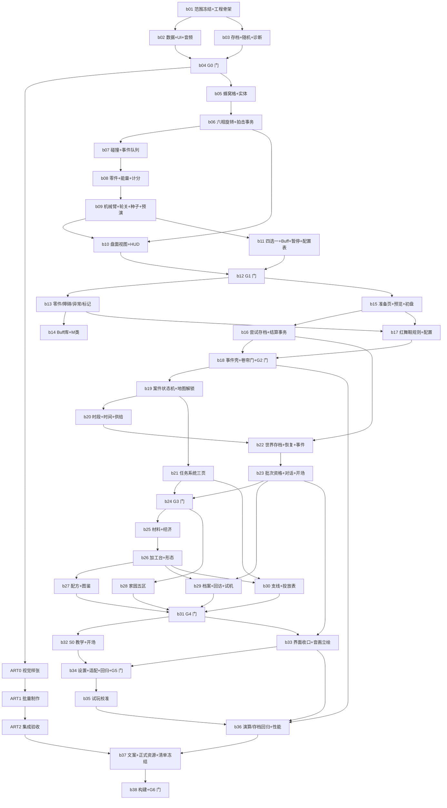

# 《Everlight-Tales》第一版分批开发执行计划

> 状态：b01～b20 已完成并验收；b21（P3-009/P3-010/P3-011 任务系统/准备页/结算面板）为下一批
> 生成日期：2026-09-20
> 覆盖范围：《第一版开发任务表》全部 127 项任务（程序 112／美术音频 15）
> 性质：本文件是**执行侧派生计划**，不取代任何权威来源

## 1. 权威边界

| 事项 | 权威来源 | 本文件的关系 |
|---|---|---|
| 任务顺序、依赖、里程碑、工时、状态 | `第一版开发任务表.xlsx`（用户本人维护，AI 只读） | 只做只读引用与分组，不回写、不另存、不重算 |
| 任务分组规则、OpenSpec 命名、方案确认门禁 | [开发执行约束](开发执行约束.md) | 逐条遵守 |
| 阶段验收门、风险、并行原则 | [第一版开发路线总览](第一版开发路线总览.md) | 批次不得跨越阶段验收门 |
| 单批需求、方案、可测试场景与实现分解 | `openspec/changes/<change-id>/` | 本文件只负责**选批与排批** |
| 派发单（OpenSpec 建立前） | `Docs/Framework/Development/Dispatch/Active/` | 按 [DispatchTemplate.md](../../Framework/Development/Dispatch/DispatchTemplate.md) 生成 |

**本文件不产生新的权威**：任务 ID、前置依赖、里程碑与状态始终以用户维护的工作簿为准；本文件只记录 AI 侧的分批边界与推进顺序，可由用户随时要求调整。

## 2. 分批原则

1. **不跨阶段验收门**：一个 OpenSpec 只覆盖同一里程碑（G0／G1／…／G6、ART0／ART1／ART2）内的任务。
2. **2～5 项一组**：按目标一致、依赖连续、共同验收边界组合；不为单任务建 change，也不把整张表塞进一个 change。
3. **依赖连续**：同组内任务在任务表的前置依赖上形成连续链或共同前置，不把无关分支硬拼。
4. **工作量可控**：单批原表上限工时合计尽量落在 30～46 小时区间，便于一次方案讨论＋一次实施窗口结束。
5. **程序与美术并行**：共用批次号，以 `b<NN>-parallel-program-…` 与 `b<NN>-parallel-art-…` 区分；两者独立走方案确认门禁与验收。
6. **P1 任务后置**：`P2-017`（关卡演算校准工具）、`P6-011`（S2/S3 零件按需实装）只在对应 P0 链完成后插入，不阻塞阶段门。
7. **每批一次确认**：实施前必须完成该 OpenSpec 的方案讨论与决策摘要确认；同一批次编号不构成跨 change 授权。

## 3. 总览

- **程序主线**：7 个阶段、112 项任务，划分为 **34 个批次**（含 4 个并行批）
- **美术音频路线**：3 个阶段、15 项任务，划分为 **3 个批次**
- **合计**：**37 个批次**，覆盖 127 项任务，无遗漏、无重复
- **推进粒度**：以里程碑为验收粒度，逐批实施；每批结束回传决策状态、修改范围、验证证据与提交号

| 里程碑 | 任务数 | 折算工时（下限～上限） | 批次数 |
|---|---:|---|---:|
| G0 工程基线 | 13 | 51～98 | 4 |
| G1 盘面可玩 | 22 | 142～244 | 7 |
| G2 一局闭环 | 18 | 140～230 | 6 |
| G3 一天闭环 | 20 | 158～254 | 5 |
| G4 成长闭环 | 15 | 104～170 | 7 |
| G5 新档自走 | 12 | 70～122 | 3 |
| G6 第一版完成 | 12 | 86～142 | 4 |
| ART0 视觉样张 | 5 | 36～62 | 1 |
| ART1 批量制作 | 7 | 74～114 | 1 |
| ART2 集成验收 | 3 | 18～30 | 1 |
| **合计** | **127** | **879～1466** | **37** |

> 工时列取自任务表原值求和，仅用于批次体量控制，不作为进度承诺。

## 4. 批次清单

### G0 工程基线（阶段0 工程准备）

| 批次 | OpenSpec change ID | 覆盖任务 | 项 | 工时 | 前置批次 |
|---|---|---|---:|---|---|
| b01 | `b01-p01-p04-engineering-baseline` | P0-001、P0-002、P0-003、P0-004 | 4 | 16～30 | — |
| b02 | `b02-p05-p08-data-ui-audio-skeleton` | P0-005、P0-006、P0-007、P0-008 | 4 | 17～32 | b01 |
| b03 | `b03-p09-p12-save-random-diagnostics` | P0-009、P0-010、P0-011、P0-012 | 4 | 14～28 | b01 |
| b04 | `b04-p013-g0-integration-gate` | P0-013 | 1 | 4～8 | b01、b02、b03 |

**批次边界说明**：b02 覆盖「数据＋UI＋音频」三条互不阻塞的基础设施链，共同验收边界是"页面壳与表加载在业务场景内可用"；b03 覆盖存档、随机、配置字段冻结与诊断；b04 是 G0 门，必须等 b01～b03 全部完成。b02 与 b03 可并行实施（写域不重叠）。

### G1 盘面可玩（阶段1 盘面核心）

| 批次 | OpenSpec change ID | 覆盖任务 | 项 | 工时 | 前置批次 |
|---|---|---|---:|---|---|
| b05 | `b05-p01-p02-hex-grid-entities` | P1-001、P1-002 | 2 | 14～26 | b04 |
| b06 | `b06-p03-p04-phase-rotation-tap-transaction` | P1-003、P1-004 | 2 | 16～26 | b05 |
| b07 | `b07-p05-p06-collision-event-queue` | P1-005、P1-006 | 2 | 12～20 | b06 |
| b08 | `b08-p07-p08-p09-parts-energy-scoring` | P1-007、P1-008、P1-009 | 3 | 18～32 | b07 |
| b09 | `b09-p10-p11-p12-p13-arm-round-determinism-preview` | P1-010、P1-011、P1-012、P1-013 | 4 | 22～38 | b08 |
| b10 | `b10-p14-p15-p16-p17-board-view-hud` | P1-014、P1-015、P1-016、P1-017 | 4 | 32～54 | b06、b09 |
| b11 | `b11-p18-p19-p20-p21-buff-choice-pause-config` | P1-018、P1-019、P1-020、P1-021 | 4 | 24～40 | b09 |
| b12 | `b12-p22-g1-acceptance` | P1-022 | 1 | 4～8 | b10、b11 |

**批次边界说明**：b05～b09 是盘面模拟器内核（纯逻辑、可离线演算），b10～b11 是盘面表现与配置装配，b12 是 G1 门。P1-014/P1-016 与 P1-004 的依赖关系意味着 b10 必须等 b06 完成，因此 b10 与 b09 尾部可重叠但整体排在 b09 之后以降低返工。

### G2 一局闭环（阶段2 一局闭环）

| 批次 | OpenSpec change ID | 覆盖任务 | 项 | 工时 | 前置批次 |
|---|---|---|---:|---|---|
| b13 | `b13-p01-p02-p03-p04-parts-obstacles-anomalies-markers` | P2-001、P2-002、P2-003、P2-004 | 4 | 30～52 | b12 |
| b14 | `b14-p05-p06-buff-library-m-form` | P2-005、P2-006 | 2 | 14～24 | b13 |
| b15 | `b15-p07-p08-p09-prep-page-preview-initial-board` | P2-007、P2-008、P2-009 | 3 | 26～40 | b12 |
| b16 | `b16-p10-p11-p12-attempt-save-settlement` | P2-010、P2-011、P2-012 | 3 | 26～42 | b15 |
| b17 | `b17-p13-p14-red-shoes-rules-and-config` | P2-013、P2-014 | 2 | 18～30 | b13、b15 |
| b18 | `b18-p15-p16-p17-p18-event-shell-roller-door-gate` | P2-015、P2-016、P2-017、P2-018 | 4 | 26～42 | b16、b17 |

**批次边界说明**：b13 是盘面内容件（零件／障碍／异常／标记）批量接入，b14 是 Buff 库与 M 类附着，b15～b16 是"准备页→初盘→尝试存档→结算事务"的一局链路，b17 是红舞鞋专属规则与关卡配置，b18 收口普通事件壳、卷帘门、演算工具（P1）与 G2 门。P2-017 为 P1 优先级，允许顺延但不阻塞 G2。

### G3 一天闭环（阶段3 一天闭环）

| 批次 | OpenSpec change ID | 覆盖任务 | 项 | 工时 | 前置批次 |
|---|---|---|---:|---|---|
| b19 | `b19-p01-p02-p03-p04-p05-case-machine-map-unlock` | P3-001、P3-002、P3-003、P3-004、P3-005 | 5 | 42～68 | b18 |
| b20 | `b20-p06-p07-p08-time-segments-supply` | P3-006、P3-007、P3-008 | 3 | 20～34 | b19 |
| b21 | `b21-p09-p10-p11-task-pages` | P3-009、P3-010、P3-011 | 3 | 26～40 | b19 |
| b22 | `b22-p12-p13-p14-p15-world-save-restore-events` | P3-012、P3-013、P3-014、P3-015 | 4 | 30～48 | b20、b16 |
| b23 | `b23-p16-p17-p18-p19-batch-eligibility-dialogue-opening` | P3-016、P3-017、P3-018、P3-019 | 4 | 34～54 | b22 |
| b24 | `b24-p20-g3-acceptance` | P3-020 | 1 | 6～10 | b23、b21 |

**批次边界说明**：b19 建立事件分层、案件状态机与地图主链；b20（时间／供给）与 b21（任务系统三页）可在 b19 后并行；b22 是双存档与恢复的最高风险批，故排在时间链之后；b23 收口批次资格、首批事件配置、对话系统与开场剧情；b24 是 G3 门。

### G4 成长闭环（阶段4 成长闭环）

| 批次 | OpenSpec change ID | 覆盖任务 | 项 | 工时 | 前置批次 |
|---|---|---|---:|---|---|
| b25 | `b25-p01-p02-materials-economy` | P4-001、P4-002 | 2 | 10～18 | b24 |
| b26 | `b26-p03-p04-workbench-form-unlock` | P4-003、P4-004 | 2 | 18～28 | b25 |
| b27 | `b27-p05-p06-p07-recipes-codex` | P4-005、P4-006、P4-007 | 3 | 16～28 | b26 |
| b28 | `b28-p08-p09-home-five-zones` | P4-008、P4-009 | 2 | 16～26 | b24 |
| b29 | `b29-p10-p11-p12-archive-revisit-trial` | P4-010、P4-011、P4-012 | 3 | 28～42 | b23、b26 |
| b30 | `b30-p13-p14-sidechains-drop-table` | P4-013、P4-014 | 2 | 12～20 | b21、b26 |
| b31 | `b31-p15-g4-acceptance` | P4-015 | 1 | 4～8 | b27、b28、b29、b30 |

**批次边界说明**：b25～b27 是"材料→货币→加工台→形态→配方→图鉴"的纵向成长链；b28 是家园五区（可并行）；b29 是档案重放／回访／试机（依赖对话与任务页）；b31 是 G4 门，等待全部成长链批次。

### G5 新档自走（阶段5 教学与表现）

| 批次 | OpenSpec change ID | 覆盖任务 | 项 | 工时 | 前置批次 |
|---|---|---|---:|---|---|
| b32 | `b32-p01-p02-p03-p04-s0-tutorial-opening` | P5-001、P5-002、P5-003、P5-004 | 4 | 26～44 | b31 |
| b33 | `b33-p05-p06-p07-p08-ui-hierarchy-audio-portraits` | P5-005、P5-006、P5-007、P5-008 | 4 | 24～40 | b31、b23 |
| b34 | `b34-p09-p10-p11-p12-settings-adaptation-regression-gate` | P5-009、P5-010、P5-011、P5-012 | 4 | 20～38 | b32、b33 |
| **并行** | `b33-parallel-art-art001-art005-visual-rnd` | ART-001～ART-005 | 5 | 36～62 | b04 |

**批次边界说明**：b32 是 S0 三段教学与新档开场（关键体验路），b33 是界面收口与音画立绘接入（可并行），b34 收口设置、真机适配、回归与 G5 门。美术 ART0 样张可从 G0 通过后即启动，与程序主线并行。

### G6 第一版完成（阶段6 校准与首发）

| 批次 | OpenSpec change ID | 覆盖任务 | 项 | 工时 | 前置批次 |
|---|---|---|---:|---|---|
| b35 | `b35-p01-p02-playtest-calibration` | P6-001、P6-002 | 2 | 18～30 | b34 |
| b36 | `b36-p03-p04-p05-regression-performance` | P6-003、P6-004、P6-005 | 3 | 20～34 | b35、b18、b33 |
| b37 | `b37-p06-p07-p08-copy-assets-freeze-audit` | P6-006、P6-007、P6-008 | 3 | 20～32 | b36、ART-013～015 |
| b38 | `b38-p09-p10-p11-p12-build-and-g6-gate` | P6-009、P6-010、P6-011、P6-012 | 4 | 28～46 | b37 |

**批次边界说明**：b35 是试玩校准（依赖 G5 可自走的构建）；b36 是演算／存档回归与性能收口；b37 对接 ART2 正式资源集成与内容清单冻结；b38 是构建链路、P1 的 S2/S3 零件范围决定与 G6 门。

### 美术音频并行路线

| 批次 | OpenSpec change ID | 覆盖任务 | 项 | 工时 | 前置 |
|---|---|---|---:|---|---|
| ART0 | `b33-parallel-art-art001-art005-visual-rnd` | ART-001、ART-002、ART-003、ART-004、ART-005 | 5 | 36～62 | P0-013（G0 门） |
| ART1 | `b39-parallel-art-art006-art012-batch-production` | ART-006、ART-007、ART-008、ART-009、ART-010、ART-011、ART-012 | 7 | 74～114 | ART0 对应领域样张 |
| ART2 | `b40-parallel-art-art013-art015-integration` | ART-013、ART-014、ART-015 | 3 | 18～30 | ART1 对应领域完成、主工程盘面 UI 稳定 |

**批次边界说明**：美术 change 独立走各自方案确认门禁，一个确认不授权另一个；ART2 的分领域验收可在单类资源完成时提前进入主工程，不等待 ART1 整包。

## 5. 批次依赖图

## 6. 推进节拍

每一批的执行循环固定为六步，不跳步：

1. **选批**：确认该批前置批次已通过验收门、任务表状态允许开工。
2. **派发**：在 `Docs/Framework/Development/Dispatch/Active/` 生成派发单（OpenSpec 建立前）；记录可写范围、只读边界与工具占用。
3. **方案讨论与确认**：至少三轮关键决策讨论，每累计两轮增量归档到[设计决定](../07-设计参考/设计决定.md)、[设计状态](../07-设计参考/设计状态.md)、[待完善设计](../07-设计参考/待完善设计.md)；提交决策摘要并取得用户确认。
4. **建立 OpenSpec**：在用户确认后才创建 `proposal.md`、`design.md`、`specs/`、`tasks.md`；正文必须列出任务表完整原始任务 ID。
5. **实施与验证**：在锁定的可写路径内实施，跑编译、框架纯度审计与批次约定的验证命令；达到 DoD 后标"待验收"，不直接标"已完成"。
6. **回传与归档**：回传决策状态、修改范围、验证证据、提交号、已知限制与未决项；建议用户手动更新任务表状态；派发单随 change 归档。

## 7. 风险与对策

| 风险 | 影响批次 | 对策 |
|---|---|---|
| 盘面模拟器做成一次性 Demo | b06～b12 | 结算顺序与 FIFO 队列在 b06/b07 一次立住；同种子演算复现作为 b09 硬验收 |
| 预演与结算耦合 | b09、b10 | 预演只算第一步终点，结算在按下拍击时已完成再播放；架构在 b06 定义时就分离"演算结果"与"播放时间轴" |
| 双存档＋结算五步＋防重 | b16、b22 | 写入时点单一化；结算标记防重作为 b16/b22 的硬验收；b22 单独成批，不与其他高风险项混做 |
| 竖屏页面互不兼容 | b02、b10、b15、b21、b26、b28 | b02 建立页面壳与通用组件，后续所有页面复用；b33 统一信息层级 |
| 待试玩数值不足 | b35、b36 | 数值全部走配置表（b11/b25），校准只改配置不改代码 |
| 业务写入框架核心 | 全部批次 | 每批固定跑 `python tools/audit_framework_purity.py` |
| 移动端触控／性能后置 | b10、b34、b36 | 盘面 UI 阶段即纳入触控与安全区；性能预算在 b36 收口 |

## 8. 首批（b01）方案确认摘要

> 这是当前唯一进入方案确认门的批次。**尚未创建任何 OpenSpec artifact**，等待用户确认。

### b01 目标

从 `Launch` 进入一个空的业务场景，并建立后续全部程序阶段的工程骨架：业务程序集与目录、可替换的项目输入抽象、启动 Procedure 注册。

### b01 覆盖任务与完成定义

| 任务 ID | 任务名称 | 完成定义（任务表原文） | 工时 |
|---|---|---|---:|
| P0-001 | 建立第一版开发基线 | 任务表范围与 G0～G6/ART0～ART2 里程碑口径确认一致 | 2～4 |
| P0-002 | 建立业务程序集与目录 | asmdef 划分清晰，业务不进入 ScriptsBuiltin，编译通过 | 4～8 |
| P0-003 | 业务启动 Procedure 接入 | 从 Launch 进入空业务场景，AppConfigs 只注册本 Procedure | 4～8 |
| P0-004 | 建立项目 InputModule | 所有输入经 InputModule 抽象，无 UnityEngine.Input 直读 | 6～10 |

### b01 拟采用的方案

**P0-002 程序集与目录**

在 `Assets/Game/Scripts/EverlightTales/` 建立业务根目录，**按 5 个程序集**划分，而非一个大程序集：

| 程序集 | 目录 | 职责 | 引用方向 |
|---|---|---|---|
| `Everlight.Tales.Data` | `Data/` | 表结构、配置 DTO、常量、枚举 | 只依赖框架 DataTable 基础类型 |
| `Everlight.Tales.Board` | `Board/` | 六相定势盘模拟器（纯逻辑、无 UnityEngine 依赖） | → Data |
| `Everlight.Tales.Meta` | `Meta/` | 世界状态、时间、存档、事件／案件、成长服务 | → Data |
| `Everlight.Tales.Events` | `Events/` | 盘面事件总线、能力事件队列、Buff 与触发器 | → Data、Board |
| `Everlight.Tales.UI` | `UI/` | 全部 UIForm／UIItem 与业务页面 | → 以上全部 |

`Board` 保持**零 UnityEngine 依赖**（仅 C# 标准库＋框架纯逻辑类型），使离线批量演算（P2-017）与同种子复现（P1-012）可在无引擎环境运行。

**目录与现有程序集的关系**

- 业务程序集**不合并进**现有 `Hotfix.asmdef`；`Hotfix` 继续承担热更程序集角色，业务程序集由 `HotfixEntry` 之后的启动链加载。
- 分层目录 `Board/Meta/Events/UI/Data` 与 asmdef 一一对应，不再额外加一层同名子目录。

**P0-003 启动链**

- 新增 `EverlightTalesProcedure`（实现现有 `IFrameworkStartupProcedure`），接入 `AppConfigs` 的 Procedure 列表，位于 `FrameworkReadyProcedure` 之后。
- 该 Procedure 只做：加载业务场景 → 初始化业务输入 → 交接到主流程，不承载玩法逻辑。
- `AppConfigs` 中只新增这一个业务 Procedure，不改动框架既有注册项。

**P0-004 输入抽象**

- 新增 `Everlight.Tales` 侧输入模块：`IInputProvider`（点击／拖动／按钮／长按）＋ `TouchInputProvider` 默认实现＋ `EditorMouseInputProvider` 编辑器回退。
- 业务代码只允许经 `InputModule` 取事件，禁止 `UnityEngine.Input` 直读；此约束在 OpenSpec 的 spec 中写成可测试场景。

**P0-001 范围冻结**

- 任务表本身已是范围与里程碑的权威记录，**不新建任何范围文档副本**。
- 本文件第 3、4 节即 AI 侧的分批归档；不写入任务表。

### b01 边界

- **纳入**：`Assets/Game/Scripts/EverlightTales/**`（新建）、`Assets/Game/ScriptableAssets/Core/AppConfigs.asset` 的 Procedure 列表新增项、`Assets/Game/Scene/` 下新增空业务场景。
- **排除**：表加载链路（b02）、UI 页面壳（b02）、声音接入（b02）、存档（b03）、任何玩法与盘面逻辑（G1）。
- **禁止**：不修改 `Assets/Game/ScriptsBuiltin/**`；不修改任务表；不改动框架既有 Procedure 顺序。

### b01 验收方式

1. 从 `Launch` 场景启动，经 `FrameworkReadyProcedure` 进入空业务场景，无报错、无缺失引用。
2. `python tools/audit_framework_purity.py` 通过，且不报告业务代码写入 `ScriptsBuiltin`。
3. Unity 编译通过，5 个业务 asmdef 的引用方向与上表一致，`Board` 程序集不引用 UnityEngine。
4. 全仓 `rg "UnityEngine\.Input"` 在业务程序集内无命中；输入事件只经 `InputModule` 暴露。
5. 移动端触摸与编辑器鼠标两条 Provider 均可触发一次可观测的输入事件。

### b01 需要用户确认的决策点

| # | 决策点 | 备选 | 建议 |
|---|---|---|---|
| D1 | 业务程序集拆分粒度 | ① 5 个 asmdef（上表）② 1 个业务 asmdef＋子目录 | ①，`Board` 零引擎依赖便于离线演算 |
| D2 | 业务程序集与 Hotfix 的关系 | ① 业务独立程序集，由启动链加载 ② 并入 Hotfix | ① |
| D3 | 输入抽象接入方式 | ① 项目侧 `InputProvider`＋`InputModule` ② 直接接框架既有输入 | ① |
| D4 | 空业务场景位置与命名 | ① `Assets/Game/Scene/` 下业务场景 ② 沿用框架场景 | ① |
| D5 | P0-001 范围冻结的落点 | ① 只认任务表＋本文件 ② 另写范围说明文档 | ① |

### b01 交付物

- `openspec/changes/b01-p01-p04-engineering-baseline/`（proposal／design／specs／tasks）
- `Docs/Framework/Development/Dispatch/Active/b01-p01-p04-engineering-baseline.md`（派发单）
- 实现侧的 5 个 asmdef、启动 Procedure、输入模块、空业务场景
- 验证证据：编译结果、纯度审计输出、输入链路可观测证据

## 9. 批次完成状态

| 批次 | 状态 | 备注 |
|---|---|---|
| b01 | 已完成 | 提交 f0dbb06 |
| b02 | 已完成 | 提交 a7e57ff/037ff01，UnitySkills Play Mode 验收通过 |
| b03 | 已完成 | 提交 1b83802，UnitySkills Play Mode 验收通过 |
| b04 | 已完成 | 提交 2318eb8，UnitySkills Play Mode 验收通过（5/5），Home 登记进 BuildSettings |
| b05 | 已完成 | 提交 46e0d6c，UnitySkills Play Mode 验收通过（69/69），蜂窝格+实体占用层 |
| b06 | 已完成 | UnitySkills Play Mode 验收通过（34/34），六相旋转+拍击结算事务 |
| b07 | 已完成 | UnitySkills Play Mode 验收通过（21/21），碰撞触发语义+FIFO 能力事件队列 |
| b08 | 已完成 | UnitySkills Play Mode 验收通过（55/55），首批零件+公共维修能量/维修对象+计分体系 |
| b09 | 已完成 | UnitySkills Play Mode 验收通过（31/31），机械臂+轮关/过轮判定+种子复现+第一步预演 |
| b10 | 已完成 | UnitySkills Play Mode 验收通过（31/31），盘面视图+棋子/设施/标记表现+操作循环UI+六分区HUD |
| b11 | 已完成 | UnitySkills Play Mode 验收通过（25/25），四选一框架+Buff数据结构与首批20项+暂停撤退菜单+关卡盘面配置表 |
| b12 | 已完成 | UnitySkills Play Mode 验收通过（19/19），G1 盘面可玩验收门关闭（维修触发接线+教学三段样张） |
| b13 | 已完成 | UnitySkills Play Mode 验收通过（38/38），盘面内容件批量接入（两零件+八障碍+异常框架+特殊目标判定） |
| b14 | 已完成 | UnitySkills Play Mode 验收通过（18/18），Buff库20条配置化接入结算 + M类形态附着框架（M-012） |
| b15 | 已完成 | UnitySkills Play Mode 验收通过（21/21），准备页携带选择 + 预览固定内容 + 初盘固定随机混合生成 |
| b16 | 已完成 | UnitySkills Play Mode 验收通过（15/15），维修尝试存档与轮恢复 + 结算事务五步防重 + 失败原因 |
| b17 | 已完成 | UnitySkills Play Mode 验收通过（21/21），红舞鞋专属规则（LR-RS）+ 第一关配置（D-051） |
| b18 | 已完成 | UnitySkills Play Mode 验收通过（20/20），普通维修事件壳 + 卷帘门 EV-N01 + G2 一局闭环验收门关闭（P2-017 顺延） |
| b19 | 已完成 | UnitySkills Play Mode 验收通过（35/35），统一事件架构与案件状态机 + 事件费用结构 + 地图节点解锁与操作 + 序章演示 |
| b20 | 已完成 | UnitySkills Play Mode 验收通过（24/24），时段显示与时间盘 + 时间推进与昼夜切换（每段 4 格口径修正）+ 昼夜刷新与普通事件供给 |
| b21～b38 | 未开始 | 前置批次未完成 |
| ART0～ART2 | 未开始 | ART0 可在 G0 门（b04）通过后启动 |

## 10. 建议用户手动更新的任务表信息

以下仅为建议，由用户决定是否写入 `第一版开发任务表.xlsx`；AI 不写入：

- `P1-004`（拍击结算事务）与 `P1-005`／`P1-006` 的依赖已连续，无需调整。
- `P2-017` 依赖 `P1-012`，但排在 G2 阶段；若不阻塞 G2 门，建议保持在 `A2` 并行组内，状态可长期置"未开始"。
- `P6-011` 依赖 `P2-001`，实际范围取决于首发清单（`P6-008`），建议在 `P6-008` 完成后再决定是否开工。
- 建议在每个批次验收通过后更新对应任务的"状态＝待验收"，阶段门通过后更新为"已完成"。
- b16 验收通过：建议将 `P2-010`（维修尝试存档与轮恢复）、`P2-011`（结算事务五步与结算面板）、`P2-012`（失败原因与轻量收尾）三行状态置为"已完成"。
- b17 验收通过：建议将 `P2-013`（红舞鞋 LR 规则实现）、`P2-014`（红舞鞋第一关配置 D-051）两行状态置为"已完成"；另建议与设计确认红舞鞋第一关棋盘档位（D-051 字面坐标含 (-2,-2) 需 n=5/半径4，与「半径 3」旧口径及怪谈档 n=10 存在口径差异，本批暂取最小合法 n=5）。
- b18 验收通过：建议将 `P2-015`（普通维修事件壳）、`P2-016`（卷帘门 EV-N01 事件配置）、`P2-018`（G2 一局闭环验收门）三行状态置为"已完成"；`P2-017`（关卡演算校准工具，P1 优先级）本批顺延，建议状态保持"未开始"、在 P6 校准阶段（b36/b38）再决定是否开工。
- b19 验收通过：建议将 `P3-001`（统一事件管理架构落地与案件状态机）、`P3-002`（事件费用结构装配）、`P3-003`（地图节点解锁与状态）、`P3-004`（地图操作）、`P3-005`（序章演示）五行状态置为"已完成"；另建议与设计确认 `P3-004`「双指拖动」与设计 19「单指拖动 + 固定视角不缩放」的口径差异（本批按 D-080 取单指拖动 + 固定视角）。
- b20 验收通过：建议将 `P3-006`（时段显示与时间盘）、`P3-007`（时间推进与昼夜切换）、`P3-008`（昼夜刷新与普通事件供给）三行状态置为"已完成"；另建议与设计确认时间格口径（本批按 00/03/06/07/15/20 多处一致的「每段 4 格、每日 16 格」把 b16 `TimeState.CellsPerPeriod` 由 6 修正为 4）。
