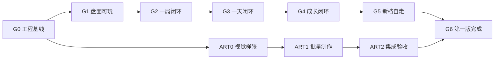

# 《Everlight-Tales》第一版开发路线总览

> 状态：开发任务结构与 Excel 任务台账均已完成
> 当前项目：`D:\unity\UnityProject\Everlight-Tales`
> 框架来源：AI-Friendly-Project（GF_X）
> Unity 版本：2022.3.62f3
> 开发投入基准：个人开发每周约 20 小时；美术／音频资源制作单独统计
> 本文不是 OpenSpec 实现方案，也不包含测试用例。

## 目的

本文回答三个问题：

1. 为完成第一版，开发需要依次建立哪些可运行能力。
2. 哪些程序、UI、灰盒、动效、音画和配置工作可以并行推进。
3. 每个阶段达到什么结果后，关键路径才能进入下一阶段。

具体任务台账使用任务 ID、依赖任务和并行组维护。每个任务的预计上限不得超过 18 小时；超过时必须在开始开发前再次拆分。任务表所有权、OpenSpec 分组与命名规范以[开发执行约束](开发执行约束.md)为准。

## 第一版范围（D-076，先做系统、怪谈后置）

第一版必须成立的系统按[第一版系统清单与优先级](../02-系统设计/00-第一版系统清单与优先级.md)推进，分四组：一局闭环 → 一天闭环 → 成长闭环 → 表现与教学。内容侧以**首个可玩切片**为垂直验证目标（三段工作台教学 + 红舞鞋第一关 + 卡住的卷帘门），十四案保留完整故事、来源、批次触发、专属挑战与奖励方向，逐关逐轮配置在系统定稿后按批补。

## 框架复用边界

### 直接复用

- `Launch`、`FrameworkReadyProcedure` 与 `IFrameworkStartupProcedure` 启动链。
- `AppConfigs` 及 Procedure、DataTable、Config、Language 加载配置。
- `GameData` Excel 源文件、DataTable 代码生成和刷新工具。
- `UIFormBase`、`UIItemBase`、`UIParams`、UITable 与 UIGroupTable。
- `EntityBase`、实体分组、对象池与资源加载。
- `GF.Sound`、SoundGroupTable 及基础音量／静音能力。
- UniTask 异步接入、资源构建、诊断和框架纯度审计。

### 项目必须新增

- 业务启动 Procedure、业务场景和项目目录（`Assets/Game/Scripts/EverlightTales`）。
- 项目 InputModule 与可替换触摸输入 Provider；产品代码不得直接读取 `UnityEngine.Input`。
- 六相定势盘：蜂窝格模型、六相旋转、拍击结算事务、FIFO 能力事件队列、重力接续、第一步预演、机械臂。
- 零件／设施／任务标记／待维修对象实体，计分与公共维修能量、Buff 与每拍四选一。
- 事件与案件分层、案件状态机、地图五区与地点解锁、四时段与时间推进、昼夜刷新。
- 任务系统三页（事件／任务／怪谈）、对话系统、准备与配装、单关结算事务。
- 世界存档与维修尝试存档双轨、结算标记防重、启动恢复面板。
- 加工台与形态、材料与维修费经济、家园五区、零件图鉴、档案重放、试机任务。
- 全部项目 UI、灰盒、配置、文案、特效与声音资源。
- 独立 2D 美术与音频路线、UI 视觉与立绘、场景背景、盘面动效以及分批导入验收链。

### 禁止修改

- 产品业务不得进入 `Assets/Game/ScriptsBuiltin/`。
- 不把 ScriptableObject 当运行时数据库；关卡配置走 DataTable 加载链。
- 不绕过框架输入抽象、UI、实体、数据和资源接入边界。
- 不为第一版提前实现皮肤、日周挑战、排名、回放、赛季、异化全量展开与商业化。

## 总体规模

当前共拆分 127 项开发与阶段验收任务，所有任务预计上限均不超过 18 小时。

| 口径 | 任务数 | 预计工时 |
|---|---:|---:|
| 程序预算：客户端、盘面、UI、配置与集成 | 112 | 751～1260 小时 |
| 美术资源预算：UI 视觉、立绘、背景、动效、音效与音乐 | 15 | 128～206 小时 |
| 全部工作合计 | 127 | 879～1466 小时 |
| 按每周 20 小时计算 | — | 约 44～73 周 |

这与早期"十几个系统、一个切片"的直觉相比明显更大。原因不是框架没有作用，而是第一版同时包含盘面模拟器（确定性演算）、一局闭环、一天闭环（地图／时段／三页／双存档）、成长闭环（加工／经济／家园）以及完整 2D 美术与音频生产链。框架降低了通用启动、数据、UI、实体、声音和资源接入成本，但不会自动提供游戏业务或正式素材。

开发过程中不得通过压缩估算来维持旧预算。如果必须缩短周期，应重新削减版本范围——优先后置表现与便利，不能砍掉"六相定势盘模拟器 → 一局闭环 → 一天闭环"的核心链。

## 开发阶段

| 阶段 | 任务数 | 工时范围 | 阶段目标 |
|---:|---:|---:|---|
| 阶段0 工程准备 | 13 | 51～98 小时 | 从 Launch 进入业务空场景，项目 InputModule、GF 数据、GF.UI、GF.Entity、存档骨架与音频接入完成 |
| 阶段1 盘面核心 | 22 | 142～244 小时 | 六相定势盘灰盒可玩：蜂窝格、旋转、拍击、碰撞、事件队列、计分、能量、机械臂、四选一，教学样张可通 |
| 阶段2 一局闭环 | 18 | 140～230 小时 | 红舞鞋第一关与卷帘门完整可通，准备→盘面→结算→中断恢复闭环 |
| 阶段3 一天闭环 | 20 | 158～254 小时 | 地图五区、四时段、昼夜刷新、任务系统三页、双存档与启动恢复，完整一天可存可续 |
| 阶段4 成长闭环 | 15 | 104～170 小时 | 加工台与形态、材料与维修费、家园五区、图鉴、试机任务，夜里收获变成白天成长 |
| 阶段5 教学与表现 | 12 | 70～122 小时 | S0 三段教学、界面层级收口、音效音乐、立绘接入、真机适配，新档可自走 |
| 阶段6 校准与首发 | 12 | 86～142 小时 | 试玩校准、回归、性能收口、正式素材集成、构建链路与第一版完成 |

程序阶段之外另有一条独立 2D 美术与音频并行路线（ART0→ART2）。音效与 BGM 属于美术资源预算，其接入位（程序侧）嵌入阶段 5。

| 美术阶段 | 任务数 | 工时范围 | 阶段目标 |
|---:|---:|---:|---|
| 并行美术0 视觉样张 | 5 | 36～62 小时 | 确认 UI 视觉、盘面视觉、立绘、背景与音效方向样张 |
| 并行美术1 批量制作 | 7 | 74～114 小时 | 零件设施图、UI 图标、立绘差分、背景、盘面动效、音效与 BGM 批量制作 |
| 并行美术2 集成验收 | 3 | 18～30 小时 | UI、盘面棋子、立绘背景音效分批导入主工程验收 |

## 关键路径

阶段不是要求所有工作流完全串行。程序主线与美术路线在 `G0` 后并行推进；立绘、背景、音效按领域分批导入，只有最终 `G6` 同时等待程序主线和 `ART2`。

## 各里程碑验收门

### G0 工程基线

从 `Launch` 进入空业务场景；项目 Procedure、InputModule、世界时钟占位、GF 数据、GF.UI、GF.Entity、存档骨架与分组配置共同运行。框架纯度审计不报告产品业务写入 `ScriptsBuiltin`。

### G1 盘面可玩

六相定势盘在灰盒 UI 下可玩：蜂窝格 n 档位生成正确，左旋／右旋咬合，拍击触发定势下落与碰撞连锁，FIFO 事件队列按序结算，计分与公共维修能量正确，第一步预演只标第一步终点。教学三段样张（撞锤／棘轮／线圈 + 墙体／维修对象／隔板）在 61 格盘上跑通；同种子演算可复现；失败原因可读。

### G2 一局闭环

红舞鞋第一关（一关三轮各 3 拍、累计 30／100／170 分、导流／分离修匣／封存）与卡住的卷帘门（2 格、40 维修费）完整可通；准备页三区与 RawImage 关卡预览、初盘固定随机混合、结算事务五步与结算面板、中断按轮恢复均正确。

### G3 一天闭环

新档能完整描述并保存一天：城市地图五区与地点解锁、四时段与时间推进、昼夜刷新（每昼夜各 4 个普通实例）、任务系统三页（事件／任务／怪谈）、世界存档与维修尝试存档双轨、启动恢复面板。结算与中断均不会重复扣时或重复发奖。

### G4 成长闭环

夜里收获变成白天成长：加工台解锁与切换形态、材料六种与维修费唯一货币、家园五区（陈列／保管／拥有物／档案重放）、零件图鉴、试机任务 T-G01~04 可玩。

### G5 新档自走

新玩家在无开发者文档的情况下完成 S0 三段教学、红舞鞋第一关与卷帘门；教学 0 时间格、可重试、不记失败；界面信息层级与音效音乐、立绘状态接入收口；真机触控与分辨率适配通过。

### G6 第一版完成

新存档可完成教学 → 红舞鞋 → 卷帘门 → 完整一天循环 → 成长 → 回访；试玩校准与存档回归通过；正式 UI、立绘、背景、动效与音效通过 `ART2` 集成验收；框架纯度审计通过；构建链路产出可运行包。

## 并行工作流

| 工作流 | 任务数 | 工时范围 | 并行原则 |
|---|---:|---:|---|
| 盘面程序 | 38 | 260～432 小时 | 沿关键路径推进；棋盘模型与结算事务先行，零件／障碍按件后接 |
| 客户端程序 | 38 | 258～428 小时 | 事件架构、时间、存档、成长服务沿阶段推进 |
| UI 与交互 | 27 | 186～310 小时 | 数据接口稳定后立即制作，不等待全部系统完成 |
| 配置与内容 | 18 | 118～204 小时 | 表结构稳定后持续录入关卡、事件、任务、配方与文案 |
| 工程管理 | 8 | 40～64 小时 | 范围冻结、诊断、演算工具、构建与走查 |
| 集成与验收 | 15 | 74～120 小时 | 每个里程碑结束集中执行 |
| 美术视觉 | 11 | 108～174 小时 | 先确认样张，再按图标、UI、立绘、背景、动效并行生产 |
| 音画与文本 | 5 | 30～52 小时 | 音效方向样张先行，批量制作与 BGM 后接，不阻塞程序灰盒 |

"并行"不表示个人可以同时消耗两份时间，而是表示任务不存在逻辑依赖。个人开发时适合把同一工作流批量处理，减少程序、UI、配置之间的频繁切换；增加协作者时可以直接按工作流分派。

## 推荐执行方式

1. 每次只把一个里程碑作为当前开发目标。
2. 从任务台账筛选当前里程碑、依赖已完成且状态为"未开始"的任务，并按目标一致、依赖连续和共同验收边界组成 OpenSpec 候选组。
3. 一个 OpenSpec 原则上覆盖 2～5 项任务，不跨阶段验收门；具体分组由任务内聚性决定。
4. 对每个 OpenSpec 候选组先与用户讨论实现方式、架构边界和生产流程；需求已确认不代表实现方案已确认。
5. 讨论完成后先提交目标、方案、边界、验收和约束的决策摘要；只有用户明确确认后，才创建或填写 OpenSpec artifacts。
6. OpenSpec change ID 使用英文 `kebab-case`，以 `b<两位序号>` 作为 CLI 兼容的执行批次号，并包含任务编号和英文概要；正文必须列出任务表中的完整原始任务 ID。
7. 同一批次存在程序与美术并行 OpenSpec 时共用批次号，例如 `b07-parallel-program-p101-p103-board-simulator` 与 `b07-parallel-art-art001-art003-visual-rnd`。
8. 优先完成 P0 任务；P1 任务（关卡演算工具、S2/S3 零件按需实装）只能在不阻塞阶段验收时后置。
9. 单项任务达到完成定义后进入"待验收"，不直接标记"已完成"；通过阶段验收门后再关闭该阶段任务。
10. 任务表始终由用户本人维护。AI 只报告建议状态、实际工时和依赖变化，不直接写入任务表。
11. 美术任务先通过 `ART0` 的代表性样张验证；之后单类资源完成即可进入主工程，不等待 `ART1` 整包完成。

## 主要风险

- 六相定势盘模拟器（拍击结算事务 + FIFO 事件队列 + 确定性演算）是最大单点：若做成一次性 Demo，会破坏后续全部内容堆量与关卡校准。
- 预演只算第一步、结算在按下拍击时已完成再播放的架构必须在一开始立住，否则连锁表现与结算耦合会反复返工。
- 双存档（世界 + 维修尝试）+ 结算事务五步 + 结算标记防重，横跨时间、事件、怪谈与成长，是一天闭环的最高风险模块。
- 竖屏页面数量较多（盘面、准备、结算、三页、地图、加工台、图鉴、家园），必须复用页面壳与通用组件，不能每个系统做一套互不兼容的导航。
- 待试玩数值与节奏较多（拍数、分数、预演密度、播放节拍、经济收支），不得靠压估算维持旧预算；缩周期先削范围。
- 移动端触控、安全区与性能预算从盘面 UI 阶段就应纳入考虑，避免后期返工。
- 项目内容不得写回 `ScriptsBuiltin`；否则破坏框架升级、纯度审计与未来项目复用。

## 与测试用例的边界

本计划只为每项任务提供"完成定义"，并为每个阶段提供"验收门"。它们用于确认开发进度，不展开操作步骤、输入数据、预期结果矩阵或回归组合。正式可执行测试用例应在具体需求进入开发前，根据当时的功能规格单独生成；本计划不会提前替代该工作。
